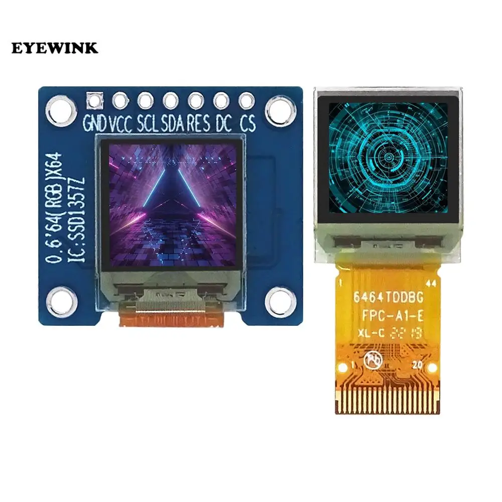
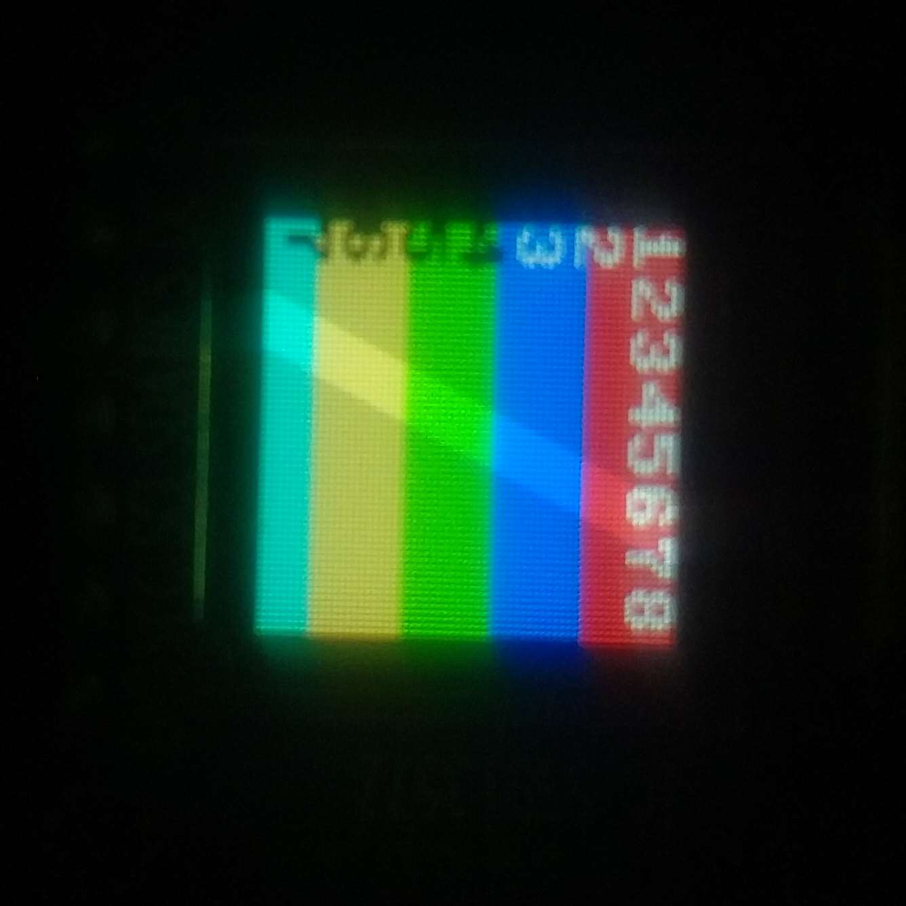

# SSD1357Z-Micropython-lib
SSD1357Z Micropython lib sold on Aliexpress ( OLED-64-RGB ) 

Credits: Based on the script created by Waveshare: https://www.waveshare.com/0.96inch-rgb-oled-module.htm
Edited for generic color 64x64 oled screens sold on Aliexpress using a similar SSD1357z IC like this one: https://www.aliexpress.com/item/1005005393885200.html

Works on MicroPython v1.21.0, ESP32C3 module
 
Caveats words and rect must be offset by X = 30 pixels to be visible , Color scheme is BGR not RGB , while its 64x64 because of the rgb its 128x128 
